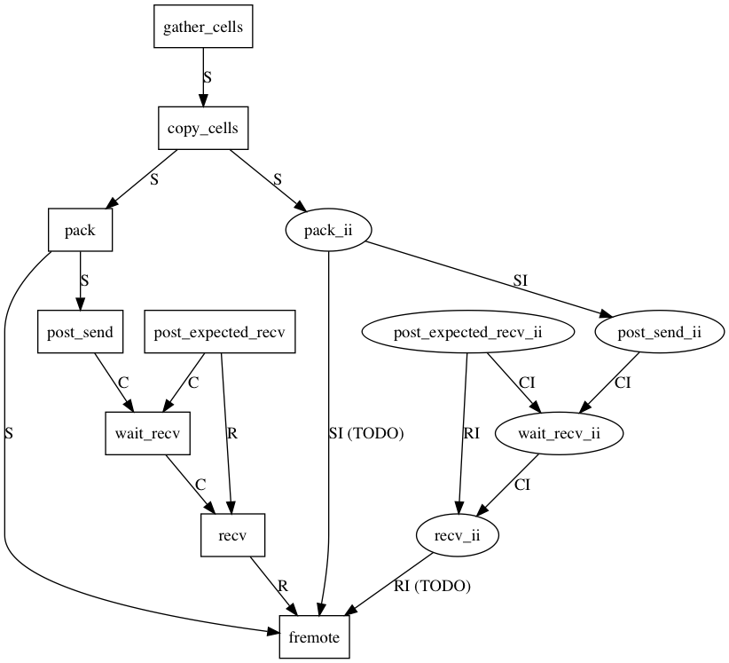

# dpdr

hiwi for dpd remote interactions

See [remote.md](remote.md) for variable descriptions

## purpose

* send, recv data from other nodes for dpd interactions
* (optional, TODO) send, recv integer data for dpd interactions (e.g. flag representing different solvents)

## usage

* all non `_ii` functions are mandatory to send and recv data
* (TODO) all `_ii` functions are optional and may be called only when tags are needed

## ticket dependencies

