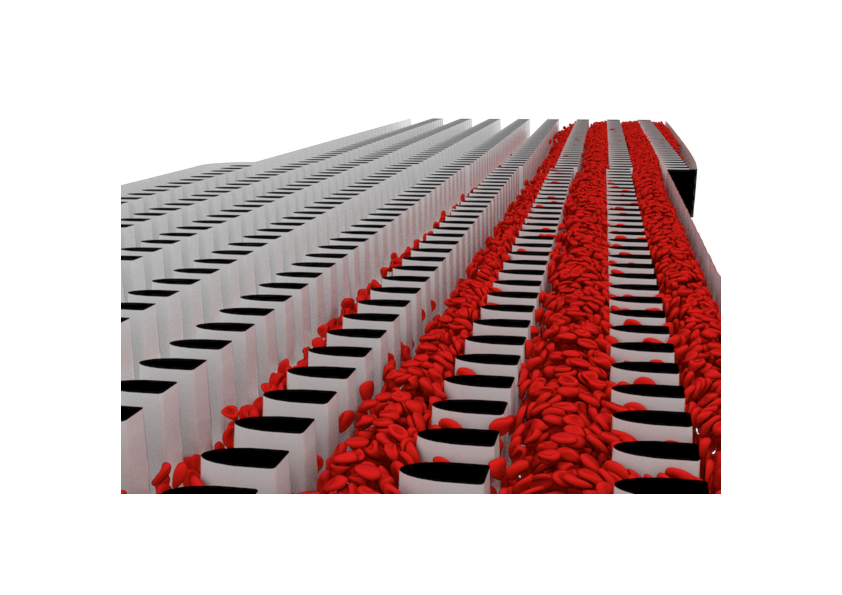

:lext: .adoc
:toclevels: 2
include::header.adoc[]

== Developer
:leveloffset:  2
include::dev/build.adoc[]
include::dev/conventions.adoc[]
include::dev/cstyle/emacs.adoc[]
include::dev/doc.adoc[]
include::dev/gource.adoc[]
include::dev/modules/algo/minmax.adoc[]
include::dev/modules/algo/scan.adoc[]
include::dev/modules/bforce.adoc[]
include::dev/modules/clist.adoc[]
include::dev/modules/cnt.adoc[]
include::dev/modules/color/main.adoc[]
include::dev/modules/comm.adoc[]
include::dev/modules/contact.adoc[]
include::dev/modules/control/main.adoc[]
include::dev/modules/coords.adoc[]
include::dev/modules/d.adoc[]
include::dev/modules/dbg.adoc[]
include::dev/modules/distr.adoc[]
include::dev/modules/exch.adoc[]
include::dev/modules/fluforces.adoc[]
include::dev/modules/frag.adoc[]
include::dev/modules/fsi.adoc[]
include::dev/modules/io/main.adoc[]
include::dev/modules/math/main.adoc[]
include::dev/modules/move.adoc[]
include::dev/modules/pair.adoc[]
include::dev/modules/parray.adoc[]
include::dev/modules/parser.adoc[]
include::dev/modules/partlist.adoc[]
include::dev/modules/rbc/forces.adoc[]
include::dev/modules/rbc/main.adoc[]
include::dev/modules/rbc/rnd.adoc[]
include::dev/modules/rbc/shape.adoc[]
include::dev/modules/rbc/stretch.adoc[]
include::dev/modules/restrain.adoc[]
include::dev/modules/rig.adoc[]
include::dev/modules/sdf/main.adoc[]
include::dev/modules/time.adoc[]
include::dev/modules/time_step.adoc[]
include::dev/modules/utils/main.adoc[]
include::dev/modules/wvel.adoc[]
include::dev/third.adoc[]
include::dev/wrap.adoc[]
:leveloffset:  0

== User
== Units
:leveloffset:  2
include::units/comm.adoc[]
include::units/error.adoc[]
include::units/hw/dev.adoc[]
include::units/hw/hst.adoc[]
include::units/linal.adoc[]
include::units/meshbb.adoc[]
include::units/mpi.adoc[]
include::units/pair.adoc[]
include::units/rbc/force.adoc[]
include::units/rbc/main.adoc[]
include::units/rbc/rnd.adoc[]
include::units/scan.adoc[]
include::units/sdf.adoc[]
include::units/x.adoc[]
