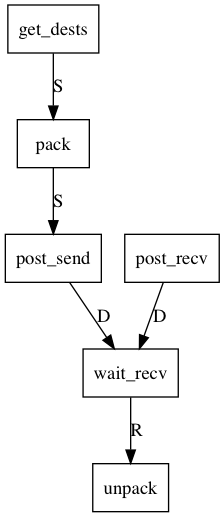

# Hiwi for generic mesh distribution

See [sim.md](../sim.md)

## purpose

* distributes mesh particles across nodes
* this is an "abstract" hiwi, e.g. it does not distribute anithing but counts
* let specific information tracking (e.g. `struct Solid` to another hiwi)

## tickets structure

see definition in [tic.h](../../src/mdstr/tic.h).

Each hiwi shoould pocess:
* `TicketC` containing common communication variables.
* `TicketP` containing common packing helpers, as well as counts.
* `TicketS` (abstract) containing send data and specific send communication variables
* `TicketR` (abstract) containing recv data and specific recv communication variables

## "abstract" functions

see generic code in [gen.h](../../src/mdstr/gen.h).

## tickets dependencies

