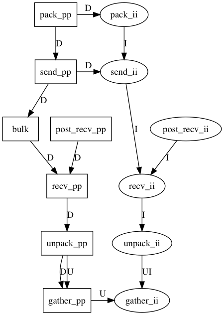

# Hiwi for solvent distribution

See [sim.md](../sim.md)

## purpose

* distributes solvent particles across nodes
* builds cell lists
* (optional) keep track of int data, such as global ids or tags

## usage

* all `_pp` functions, as well as `bulk`, are mandatory to distribute particles (see ticket dependencies below for the order of calls within a step).
* The `_ii` functions are optional and may be called only when global ids and/or tags are needed.
* for each int data, 2 tickets (`TicketI` and `TicketUI`) are needed. 

## ticket dependencies:

