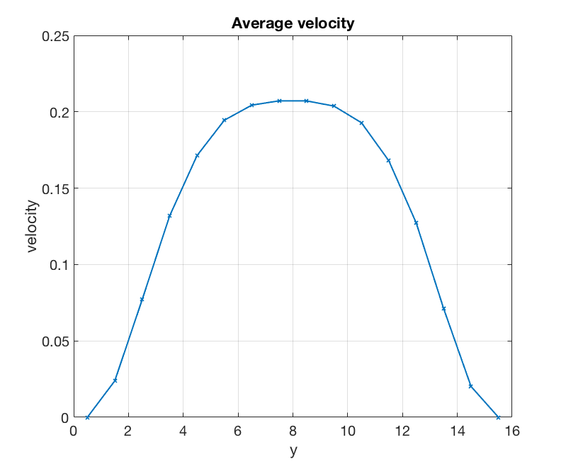
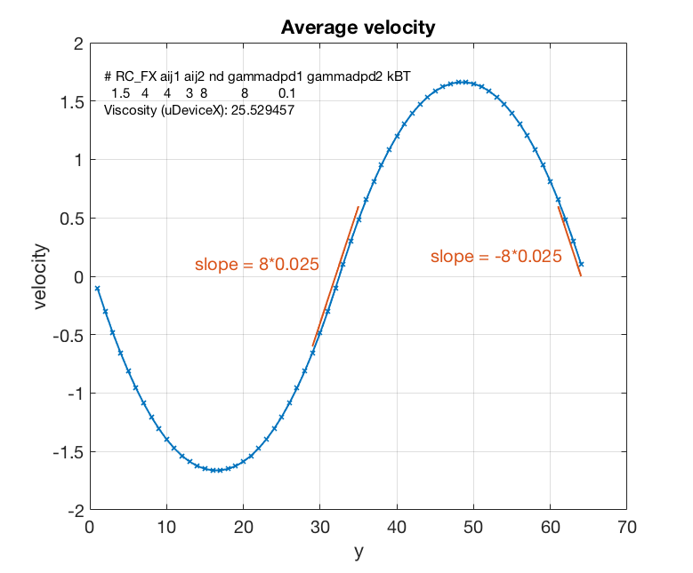
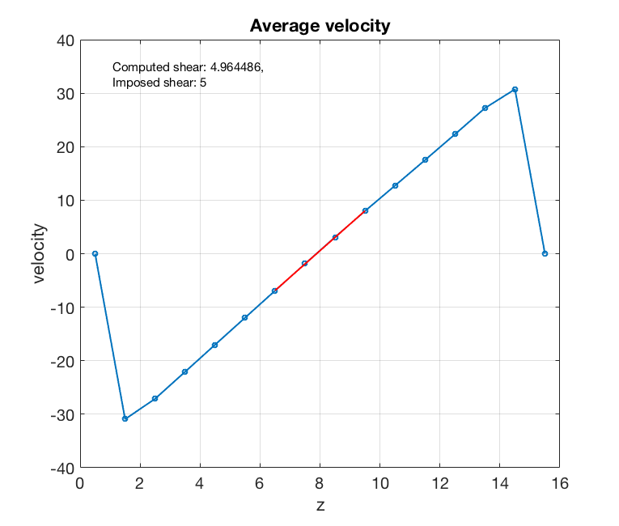
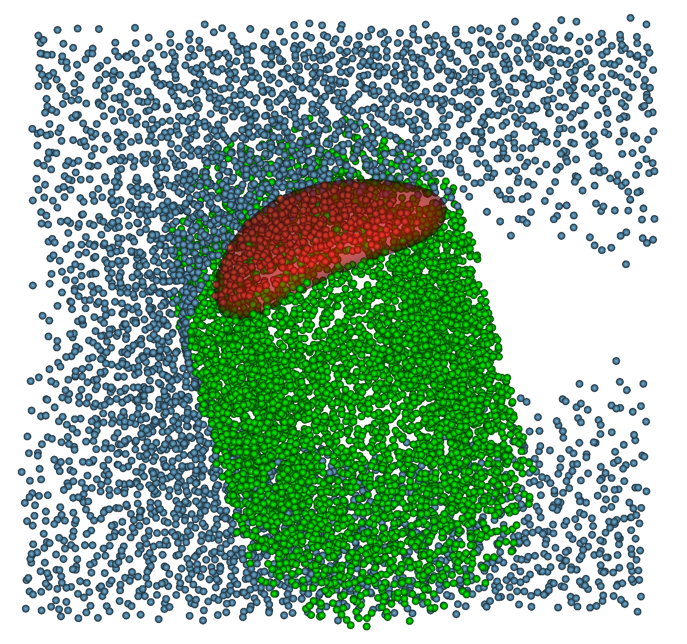
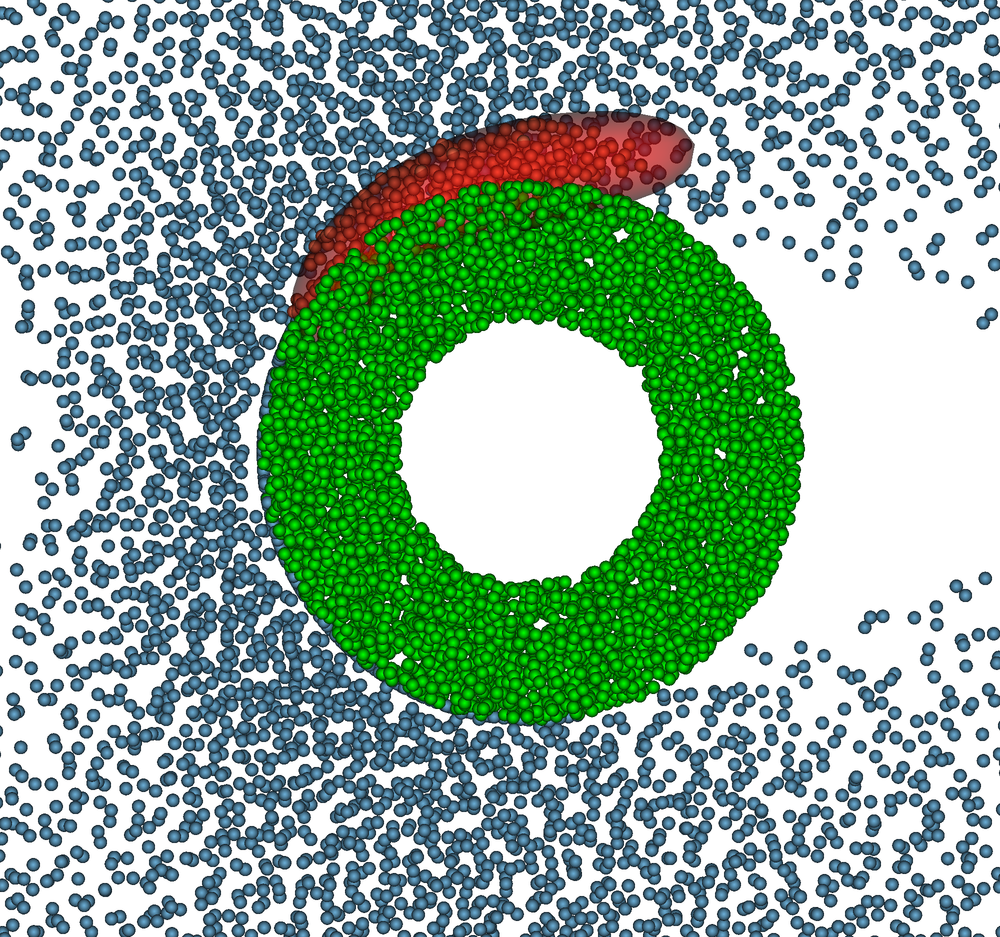

## Poiseuille velocity profile

## Double Poiseuille with the same viscosity

## Double Poiseuille velocity profile with different viscosities

## Shear flow velocity profile

## RBC in shear flow

## RBC around a post

