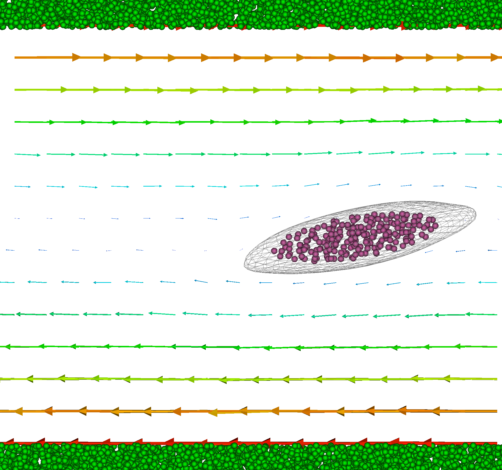

uDeviceX
===
The uDeviceX folders is organized into:
* cuda-dpd: code for the DPD interactions
* cuda-rbc: code for the RBC model
* mpi-dpd: the simulation code
* tools: various tools

Former dpd.cu and solvent-exchange.cu kernals:
packinghalo.decl.h and bipsbatch.decl.h

